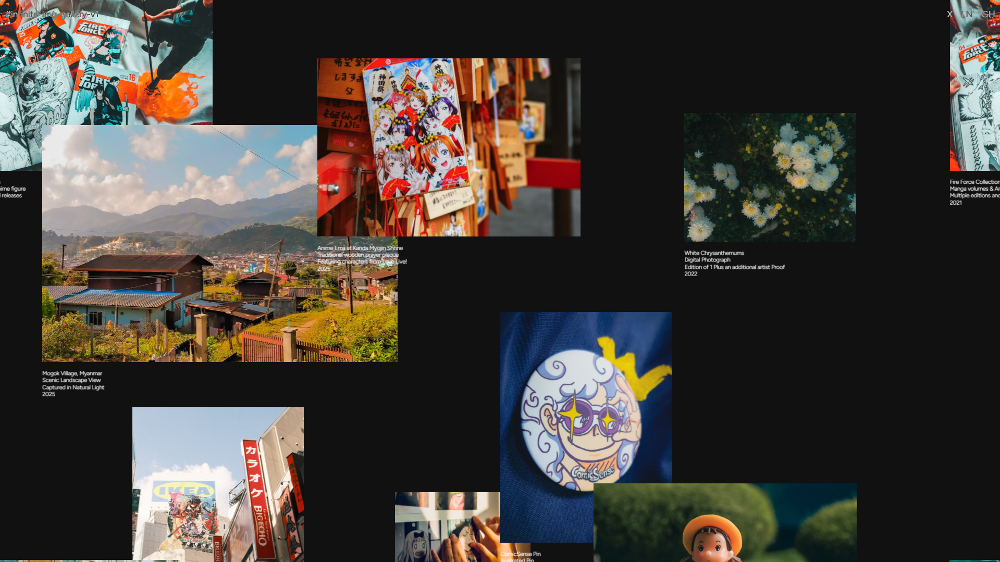

# Infinite Image Gallery V1

An **interactive infinite-scroll image grid** built with **React**, **GSAP**, and **Tailwind CSS**, featuring a smooth drag-based navigation system, dynamic grid replication, animated captions, and a modal popup preview. Optimized for immersive visual storytelling and portfolio-style image browsing.

[](https://infinite-img-gallery-v1.vercel.app/)

---

## ✨ Features

* 🖼️ **Infinite Image Grid** with seamless x/y scrolling
* 🖱️ **Click-and-Drag Navigation** with touch support
* 🧲 **GSAP Animations** for image and caption reveal
* 🪟 **Popup Modal** for fullscreen preview with caption
* 🧩 **Smart Tiling** using repeated DOM elements with offset tracking
* 💡 **Mouse Tracking** for subtle parallax and motion ease
* 🖋️ **SplitText Animation** for staggered caption entry
* 📱 **Responsive Behavior** with scalable tile layout

---

## 🧠 How It Works

* **Grid Items** are duplicated in both X and Y directions to give the illusion of infinite space.
* **GSAP's `SplitText`** plugin animates captions on intersection with the viewport.
* **Mouse and Touch Input** controls the scroll target, using smoothed interpolation for motion.
* **Popup Viewer** uses GSAP animations on entry/exit with a caption passed via state.
* **Images reposition** based on scroll and wrap around when out of bounds to create the infinite loop.
* **Tile Scaling** adjusts to screen ratio using a fixed original grid size.

---

## 🛠️ Built With

* [**React**](https://reactjs.org/) – UI library for modular components
* [**GSAP**](https://gsap.com) – Animation library for smooth transitions
* [**Tailwind CSS**](https://tailwindcss.com) – Utility-first CSS framework
* [**Vite**](https://vitejs.dev/) – Lightning-fast dev server
* [**SplitText** (GSAP Plugin)](https://gsap.com/docs/v3/Plugins/SplitText/) – For animating caption text

---

## 🚀 Getting Started

```bash
# Clone the repository
git clone https://github.com/riki-k-dev/infinite-img-gallery-v1.git

cd infinite-img-gallery-v1

# Install dependencies
npm install

# Start development server
npm run dev

# Build for production
npm run build

# Preview build
npm run preview
```

---

## 📁 Folder Structure

```
/public
  ├── img/           → Image assets
  └── fonts/         → Font assets
/src
  ├── pages/
  │   └── Index.tsx  → Entry section for InfiniteGrid
  ├── components/
  │   ├── InfiniteGrid.tsx  → Main logic and rendering for image grid
  │   └── Loader.tsx        → Loader logic
  ├── styles/
  │   ├── index.css         → Global styles and Tailwind imports
  │   ├── font.css          → Font css 
  │   └── loader.css        → Loder css
  ├── App.tsx       → Navigation and layout shell
  └── main.tsx      → Entry point
```

---

## 📸 Image Credits

All photographs used in this project are sourced from **[Unsplash](https://unsplash.com/)** under the [Unsplash License](https://unsplash.com/license).

Credits:

* \[img1.jpg] Fire Force Collection by [Branden Skeli](https://unsplash.com/@branden_skeli)
* \[img2.jpg] Mogok Village by [Light Yagamii](https://unsplash.com/@light51)
* \[img3.jpg] Anime Ema at Kanda Myojin Shrine by [Susann Schuster](https://unsplash.com/@susannschuster)
* \[img4.jpg] White Chrysanthemums by [Amid Hasan Emon](https://unsplash.com/de/@emonphoto)
* \[img5.jpg] Shibuya Scene by [Luca Merz](https://unsplash.com/@lucadahsavage)
* \[img6.jpg] Anime Prints by [Gracia Dharma](https://unsplash.com/@graciadharmaa)
* \[img7.jpg] ComicSense Pin by [Adhitya Sibikumar](https://unsplash.com/@adhitya_2505)
* \[img8.jpg] My Neighbor Totoro Figurine by [Afif Ramdhasuma](https://unsplash.com/@javaistan)
* \[img9.jpg] Amusement Swings by [Huong Do](https://unsplash.com/ko/@huongddn)

---

## 📄 License

MIT License.
